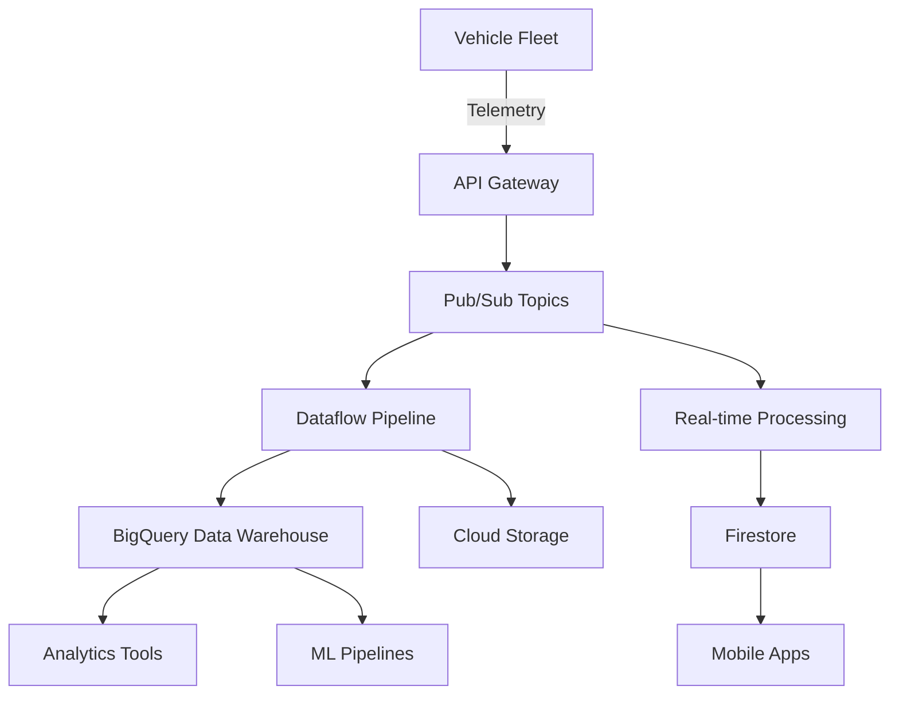

# Building Analytics Infrastructure for Connected Vehicles

When Ford decided to transform from a traditional automaker into a technology company, one of the biggest challenges was building the data infrastructure to support millions of connected vehicles. Over the past year, I've been leading the analytics infrastructure development for Ford's connected services platform. Here's how we built a system that processes over 10 million data points daily and turns them into actionable business insights.

## The Challenge: Scale and Real-Time Processing

Connected vehicles generate an enormous amount of data:

- **Location data**: GPS coordinates every 30 seconds
- **Vehicle telemetry**: Engine diagnostics, fuel consumption, battery status
- **User interactions**: Feature usage, app interactions, preferences
- **Environmental data**: Weather, traffic, road conditions

### Initial Requirements

When we started, the requirements seemed straightforward:

1. **Process real-time data** from 500K+ connected vehicles
2. **Store historical data** for trend analysis and machine learning
3. **Generate insights** for business teams and customer features
4. **Ensure data privacy** and comply with automotive regulations
5. **Scale to millions** of vehicles over the next 3 years

What we quickly learned was that automotive data has unique challenges compared to typical web analytics.

## Architecture Overview

After evaluating several approaches, we settled on a cloud-native architecture using Google Cloud Platform:



### Key Components

**1. Data Ingestion Layer**
- Cloud Pub/Sub for reliable message queuing
- API Gateway for authentication and rate limiting
- Protocol Buffers for efficient data serialization

**2. Stream Processing**
- Dataflow (Apache Beam) for real-time ETL
- Custom processing logic for data validation and enrichment
- Dead letter queues for error handling

**3. Storage Layer**
- BigQuery for analytics workloads
- Cloud Storage for raw data archiving
- Firestore for real-time application data

**4. Analytics and ML**
- Vertex AI for machine learning pipelines
- Looker Studio for business intelligence
- Custom dashboards for operational monitoring

## Technical Implementation

### Data Ingestion Pipeline

The first challenge was handling the volume and variety of vehicle data. Vehicles don't always have reliable connectivity, so our ingestion system needed to handle:

- **Batch uploads** when vehicles reconnect after being offline
- **Duplicate detection** when vehicles retry failed transmissions
- **Data validation** to ensure quality and completeness

```python
# Simplified version of our ingestion handler
from google.cloud import pubsub_v1
import json
from datetime import datetime

class VehicleDataIngester:
    def __init__(self):
        self.publisher = pubsub_v1.PublisherClient()
        self.topic_path = self.publisher.topic_path(
            'ford-analytics', 'vehicle-telemetry'
        )
    
    def process_vehicle_batch(self, vehicle_id, data_points):
        """Process a batch of data points from a vehicle"""
        validated_points = []
        
        for point in data_points:
            if self.validate_data_point(point):
                # Add metadata
                point['ingestion_time'] = datetime.utcnow().isoformat()
                point['vehicle_id'] = vehicle_id
                validated_points.append(point)
        
        # Deduplicate based on timestamp and vehicle_id
        deduplicated = self.deduplicate_points(validated_points)
        
        # Publish to Pub/Sub
        for point in deduplicated:
            message_data = json.dumps(point).encode('utf-8')
            future = self.publisher.publish(
                self.topic_path, 
                message_data,
                vehicle_id=vehicle_id,
                data_type=point.get('type', 'telemetry')
            )
            
        return len(deduplicated)
    
    def validate_data_point(self, point):
        """Validate required fields and data types"""
        required_fields = ['timestamp', 'location', 'type']
        
        for field in required_fields:
            if field not in point:
                return False
        
        # Validate timestamp format
        try:
            datetime.fromisoformat(point['timestamp'])
        except ValueError:
            return False
            
        # Validate location coordinates
        location = point['location']
        if not (-90 <= location.get('lat', 0) <= 90):
            return False
        if not (-180 <= location.get('lng', 0) <= 180):
            return False
            
        return True
```

### Real-Time Processing with Dataflow

For real-time processing, we built Apache Beam pipelines that run on Dataflow:

```python
import apache_beam as beam
from apache_beam.options.pipeline_options import PipelineOptions

class VehicleDataProcessor:
    
    @staticmethod
    def enrich_with_context(element):
        """Add contextual information to raw vehicle data"""
        # Add weather data
        weather = WeatherAPI.get_current_weather(
            element['location']['lat'], 
            element['location']['lng']
        )
        element['weather'] = weather
        
        # Add traffic data
        traffic = TrafficAPI.get_traffic_conditions(
            element['location']['lat'], 
            element['location']['lng']
        )
        element['traffic'] = traffic
        
        # Calculate derived metrics
        if element['type'] == 'engine_data':
            element['fuel_efficiency'] = calculate_efficiency(element)
        
        return element
    
    @staticmethod
    def aggregate_trip_data(elements):
        """Aggregate individual data points into trip summaries"""
        trips = {}
        
        for element in elements:
            trip_id = element.get('trip_id')
            if trip_id not in trips:
                trips[trip_id] = {
                    'start_time': element['timestamp'],
                    'vehicle_id': element['vehicle_id'],
                    'data_points': []
                }
            trips[trip_id]['data_points'].append(element)
        
        # Calculate trip metrics
        for trip_id, trip in trips.items():
            trip['duration'] = calculate_duration(trip['data_points'])
            trip['distance'] = calculate_distance(trip['data_points'])
            trip['avg_speed'] = trip['distance'] / trip['duration']
            
        return trips.values()

def run_pipeline():
    options = PipelineOptions([
        '--project=ford-analytics',
        '--region=us-central1',
        '--runner=DataflowRunner',
        '--streaming=true'
    ])
    
    with beam.Pipeline(options=options) as pipeline:
        (pipeline
         | 'Read from Pub/Sub' >> beam.io.ReadFromPubSub(
             subscription='projects/ford-analytics/subscriptions/vehicle-data'
         )
         | 'Parse JSON' >> beam.Map(json.loads)
         | 'Enrich Data' >> beam.Map(VehicleDataProcessor.enrich_with_context)
         | 'Window into Sessions' >> beam.WindowInto(
             beam.window.Sessions(gap_size=300)  # 5-minute gaps end trips
         )
         | 'Group by Vehicle' >> beam.GroupByKey()
         | 'Aggregate Trips' >> beam.Map(VehicleDataProcessor.aggregate_trip_data)
         | 'Write to BigQuery' >> beam.io.WriteToBigQuery(
             table='ford-analytics.vehicle_data.trips',
             write_disposition=beam.io.BigQueryDisposition.WRITE_APPEND
         )
        )
```

### Data Modeling in BigQuery

We designed our BigQuery schema to optimize for both analytical queries and cost:

```sql
-- Main vehicle events table (partitioned by date, clustered by vehicle_id)
CREATE TABLE `ford-analytics.vehicle_data.events` (
  event_id STRING NOT NULL,
  vehicle_id STRING NOT NULL,
  timestamp TIMESTAMP NOT NULL,
  event_type STRING NOT NULL,
  location GEOGRAPHY,
  
  -- Vehicle telemetry (nested for efficiency)
  engine_data STRUCT<
    rpm INT64,
    fuel_level FLOAT64,
    engine_temp FLOAT64,
    odometer INT64
  >,
  
  -- Environmental context
  weather STRUCT<
    temperature FLOAT64,
    humidity FLOAT64,
    conditions STRING
  >,
  
  -- User interactions
  user_action STRUCT<
    feature_used STRING,
    interaction_type STRING,
    duration_seconds INT64
  >,
  
  -- Processing metadata
  ingestion_time TIMESTAMP,
  processing_time TIMESTAMP
)
PARTITION BY DATE(timestamp)
CLUSTER BY vehicle_id, event_type;

-- Aggregated trip summaries (for faster analytics)
CREATE TABLE `ford-analytics.vehicle_data.trip_summaries` (
  trip_id STRING NOT NULL,
  vehicle_id STRING NOT NULL,
  start_time TIMESTAMP NOT NULL,
  end_time TIMESTAMP NOT NULL,
  
  -- Trip metrics
  distance_miles FLOAT64,
  duration_minutes INT64,
  avg_speed_mph FLOAT64,
  max_speed_mph FLOAT64,
  
  -- Efficiency metrics
  fuel_consumed_gallons FLOAT64,
  mpg FLOAT64,
  eco_score INT64,
  
  -- Route information
  start_location GEOGRAPHY,
  end_location GEOGRAPHY,
  route_polyline STRING,
  
  -- Context
  weather_conditions ARRAY<STRING>,
  traffic_incidents INT64
)
PARTITION BY DATE(start_time)
CLUSTER BY vehicle_id;
```

## Analytics and Business Intelligence

### Key Performance Indicators

With the infrastructure in place, we built dashboards to track key metrics:

**Vehicle Health Metrics**
- Engine diagnostic alert rates
- Predictive maintenance recommendations
- Battery health trends (for electric vehicles)

**User Engagement Metrics**
- Feature adoption rates
- Session duration and frequency
- Geographic usage patterns

**Business Metrics**
- Service subscription conversion rates
- Customer satisfaction correlation with feature usage
- Revenue attribution to connected services

### Real-Time Alerting

We implemented real-time alerting for critical events:

```python
class VehicleAlertProcessor:
    def __init__(self):
        self.alert_rules = [
            {
                'name': 'critical_engine_temp',
                'condition': lambda data: data.get('engine_temp', 0) > 220,
                'priority': 'high',
                'notification': 'immediate'
            },
            {
                'name': 'theft_alert',
                'condition': self.detect_unusual_movement,
                'priority': 'critical',
                'notification': 'immediate'
            },
            {
                'name': 'maintenance_due',
                'condition': lambda data: data.get('odometer', 0) % 5000 == 0,
                'priority': 'medium',
                'notification': 'scheduled'
            }
        ]
    
    def process_alerts(self, vehicle_data):
        alerts = []
        
        for rule in self.alert_rules:
            if rule['condition'](vehicle_data):
                alert = {
                    'vehicle_id': vehicle_data['vehicle_id'],
                    'alert_type': rule['name'],
                    'priority': rule['priority'],
                    'timestamp': datetime.utcnow(),
                    'data': vehicle_data
                }
                alerts.append(alert)
                
                if rule['notification'] == 'immediate':
                    self.send_immediate_notification(alert)
        
        return alerts
```

## Challenges and Solutions

### 1. Data Privacy and Compliance

**Challenge**: Automotive data includes personally identifiable information and location data that requires special handling.

**Solution**: 
- Implemented data anonymization at ingestion
- Built consent management system
- Added data retention policies
- Created audit trails for compliance

### 2. Scale and Cost Management

**Challenge**: Processing costs grew linearly with vehicle count, threatening project viability.

**Solution**:
- Implemented intelligent data sampling for non-critical metrics
- Used BigQuery clustering and partitioning to reduce query costs
- Built cost monitoring and alerting
- Optimized data pipeline efficiency

### 3. Real-Time vs. Batch Processing

**Challenge**: Balancing real-time alerts with cost-effective batch processing.

**Solution**:
- Created tiered processing: real-time for alerts, near-real-time for dashboards, batch for analytics
- Used Cloud Functions for lightweight real-time processing
- Implemented intelligent routing based on data priority

## Results and Impact

After 12 months of operation, our analytics infrastructure has delivered significant value:

### Technical Metrics
- **99.9% uptime** for data ingestion
- **Sub-2-second latency** for real-time alerts
- **10M+ data points** processed daily
- **35% cost reduction** compared to initial estimates

### Business Impact
- **40% improvement** in predictive maintenance accuracy
- **25% increase** in customer satisfaction for connected services
- **$2M annual savings** from optimized fleet operations
- **15% boost** in service subscription rates

## Lessons Learned

### 1. Start Simple, Scale Gradually
We initially tried to build a comprehensive solution from day one. Starting with a simpler architecture and evolving based on actual usage patterns was much more effective.

### 2. Data Quality is Critical
Poor data quality can undermine the entire analytics pipeline. Investing early in validation and monitoring pays dividends.

### 3. Real-Time Isn't Always Necessary
Not every metric needs real-time processing. Understanding business requirements helps optimize for cost and complexity.

### 4. Privacy by Design
Building privacy and compliance into the architecture from the beginning is much easier than retrofitting it later.

## Future Roadmap

### Machine Learning Integration
- Predictive maintenance models
- Personalized user experience algorithms
- Anomaly detection for security

### Advanced Analytics
- Real-time traffic optimization
- Dynamic pricing for services
- Cross-vehicle pattern recognition

### Edge Computing
- On-vehicle processing for immediate decisions
- Reduced data transmission costs
- Improved privacy through local processing

## Conclusion

Building analytics infrastructure for connected vehicles requires balancing real-time processing needs with cost constraints, privacy requirements with business value, and technical complexity with operational simplicity.

The key is to start with clear business objectives, design for scale from the beginning, and iterate based on actual usage patterns. Most importantly, remember that the infrastructure is just the foundation—the real value comes from the insights and actions that the data enables.

*Have you worked on similar large-scale analytics projects? I'd love to hear about your experiences and challenges. Connect with me on [LinkedIn](https://linkedin.com/in/johnhentrich) or drop me an [email](mailto:john.hentrich@gmail.com).*

---

*John Hentrich leads analytics infrastructure development at Ford, focusing on connected vehicle data processing and business intelligence. He has 15 years of experience in scaling data systems and driving growth through analytics.*